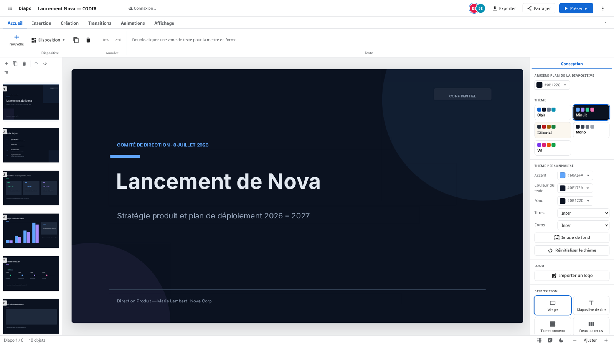
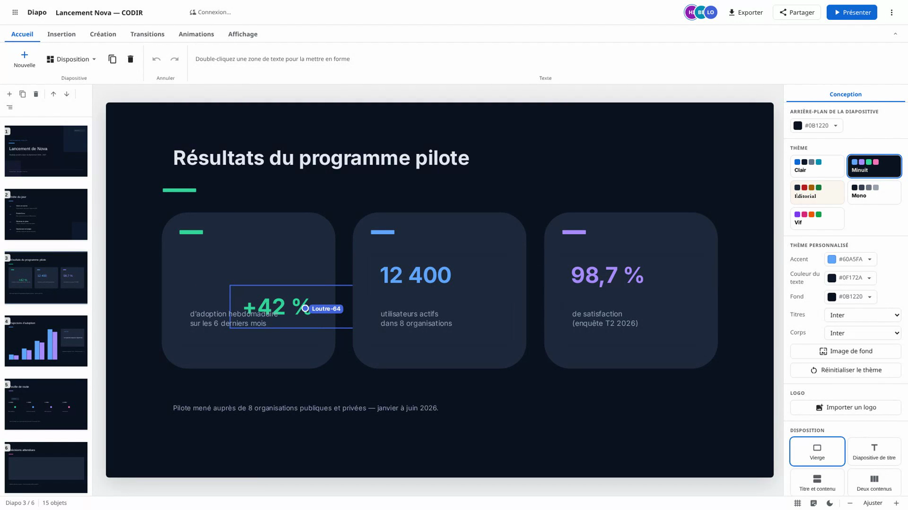

# Diapo

A collaborative presentation editor. Build, edit and present slide decks in the browser, with
real-time multi-user editing, PowerPoint (`.pptx`) import and export, and single sign-on. Built
with Next.js, Django REST Framework and Yjs, and designed to be self-hosted in an EU-hosted
environment.


*35-second product tour — [watch it in full quality (MP4, 7 MB)](docs/media/diapo-intro.mp4).*

|  |  |
| :--: | :--: |
| The editor: free-form canvas, themes, filmstrip | Real-time collaboration: live cursors and remote selections |

Diapo follows the conventions of [La Suite numérique](https://github.com/suitenumerique): it uses
the `cunningham` design system and the `django-lasuite` OIDC integration, and stores identities on
the OIDC `sub` claim so it can share a single sign-on with the rest of the suite.

## Features

- Real-time collaborative editing (multiple cursors, presence, conflict-free merges).
- A free-form slide canvas: text boxes, shapes, images, video, audio, tables and charts.
- Rich text with headings, lists, colours, fonts, links and alignment.
- Themes, layouts, sections, speaker notes and slide transitions.
- A deck theme editor: custom colours, fonts, default background, footer and logo applied to
  every slide.
- Diagrams generated from a text outline (process, cycle, hierarchy, pyramid, list), inserted
  as ordinary editable shapes.
- Entrance, emphasis and exit animations with ordered click sequencing in the presenter.
- Spreadsheet data import: paste cells from Excel or LibreOffice Calc into charts and tables,
  or import a CSV.
- Outline view for fast drafting and restructuring.
- Import and export of PowerPoint `.pptx`, plus PDF export.
- Version history with named restore points.
- Optional OIDC single sign-on (Keycloak or any OpenID Connect provider).
- Accessibility features aligned with RGAA 4.1 (keyboard operation, reduced-motion support,
  a built-in checker for contrast and alternative text). See [docs/accessibility.md](docs/accessibility.md).

## Architecture

| Layer | Technology |
| --- | --- |
| Frontend | Next.js (App Router) + React, `cunningham` design system, TipTap editor |
| Realtime | Yjs CRDT scene graph, Hocuspocus collaboration server (`y-provider`) |
| Backend | Django 5 + Django REST Framework |
| Identity | OIDC via `django-lasuite` (custom `sub`-keyed user model) |
| Storage | PostgreSQL (documents), filesystem media storage — S3 support planned, Redis (cache, Celery) |

The deck content lives authoritatively in a Yjs document, persisted through the collaboration
server. The Django backend owns presentations, access control and `.pptx` conversion. See
[docs/architecture.md](docs/architecture.md) for detail and [docs/crdt-schema.ts](docs/crdt-schema.ts)
for the shared-type schema.

## Quick start

### With Docker Compose (recommended)

Brings up the frontend, collaboration server, backend, PostgreSQL and Redis:

```bash
docker compose up
```

Then open http://localhost:3000. The default stack runs without authentication (any visitor can
edit), which is convenient for local development.

To enable Keycloak single sign-on, use the `full` profile with an env file:

```bash
cp .env.example .env
docker compose --profile full --env-file .env up
```

### Bare metal (no containers)

Backend (Python 3.13, [`uv`](https://docs.astral.sh/uv/)):

```bash
cd src/backend
uv venv && uv pip install -e '.[dev]'
uv run python manage.py migrate
uv run python manage.py runserver
```

Frontend (Node 22) and the collaboration server, in two terminals:

```bash
cd src/frontend
npm install
npm run collab            # Hocuspocus collaboration server
npm run dev               # Next.js dev server on http://localhost:3000
```

## Project layout

```
src/backend      Django project (settings, core app, .pptx import, REST API)
src/frontend     Next.js app, the slide editor, .pptx/PDF export, and servers/y-provider (collaboration)
docs             Architecture, accessibility and the CRDT schema reference
docker-compose.yml  One-command development stack
```

## Configuration

All configuration is environment-driven, so the same code runs locally and in production. Django
selects a configuration class through `DJANGO_CONFIGURATION` (`Development` by default,
`Production` for deployments). See `.env.example` and `src/backend/README.md` for the full list of
variables, including the OIDC settings.

## Testing

```bash
# Backend (the render tests need poppler-utils installed: apt-get install poppler-utils)
cd src/backend && uv run ruff check . && uv run python manage.py test

# Frontend
cd src/frontend && npm run typecheck && npm run build
npm run verify:crdt && npm run verify:deck && npm run verify:text   # CRDT invariants
```

## Contributing

Contributions are welcome. Please read [CONTRIBUTING.md](CONTRIBUTING.md): commits are signed off
under the Developer Certificate of Origin, and larger changes should be discussed first. Notable
changes are recorded in [CHANGELOG.md](CHANGELOG.md).

## Security

Please report vulnerabilities privately, as described in [SECURITY.md](SECURITY.md). Do not open
public issues for security problems.

## License

MIT. See [LICENSE](LICENSE) and [NOTICE](NOTICE) for third-party attributions.
